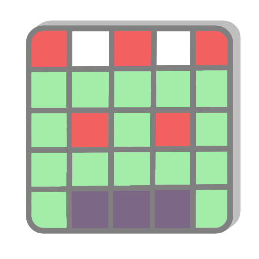
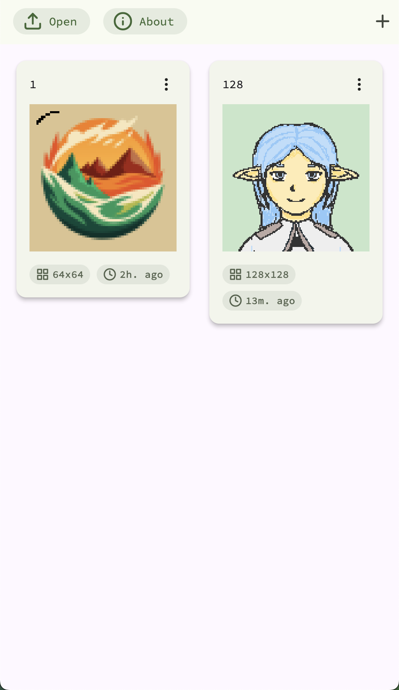
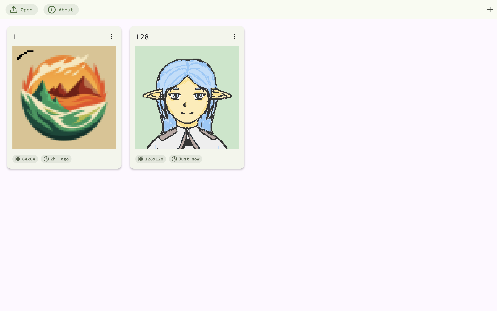
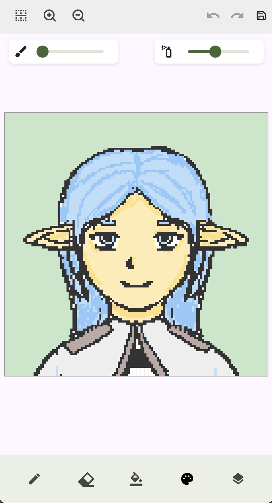
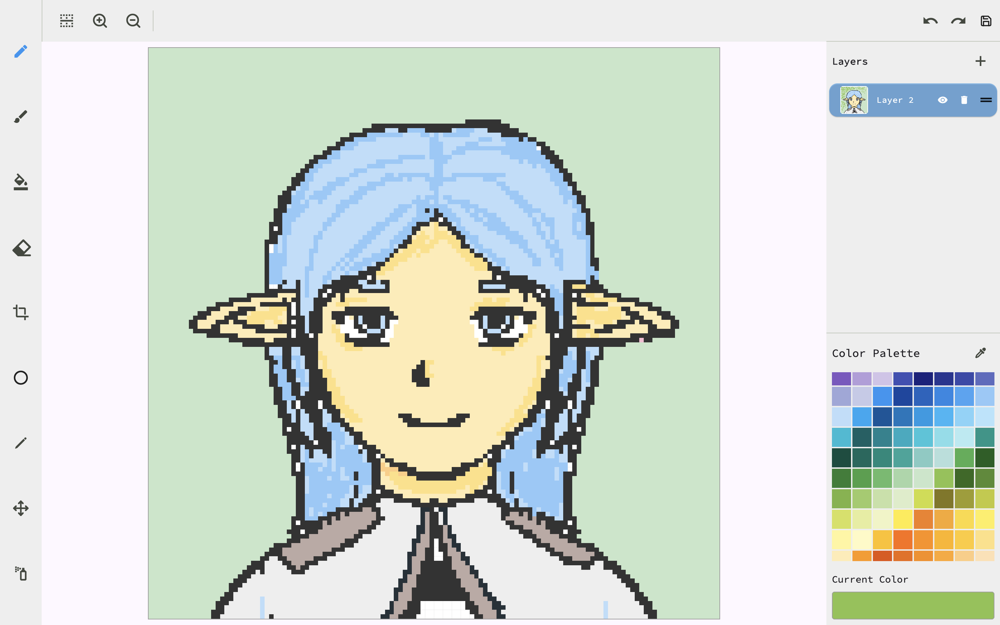
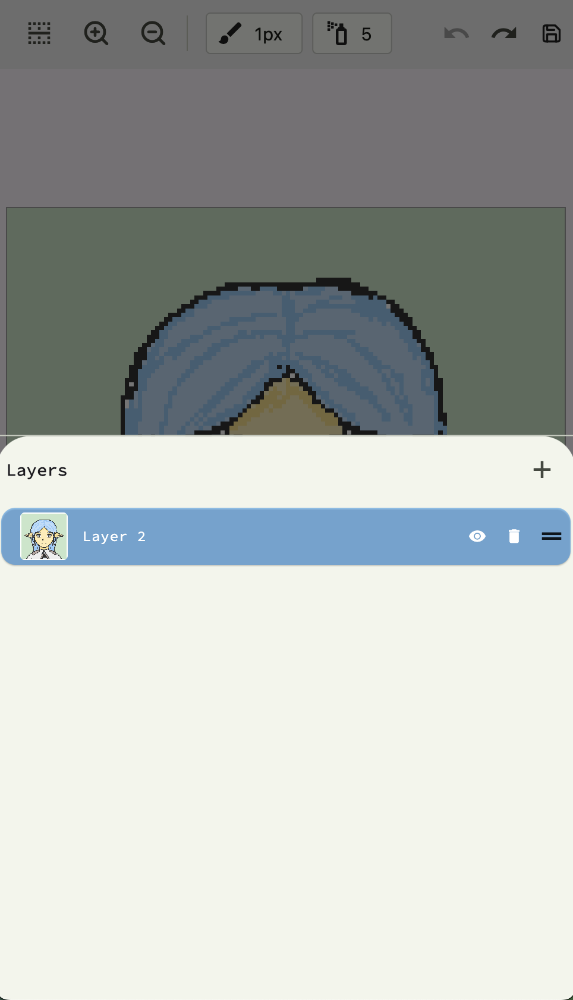

# PixelVerse

PixelVerse is a powerful and intuitive pixel art creation tool designed for both beginners and experienced pixel artists. With a wide range of features and a user-friendly interface, PixelVerse makes it easy to bring your pixelated visions to life.



## Features

- **Intuitive Drawing Tools**: Pencil, brush, eraser, and more for precise pixel manipulation.
- **Advanced Shape Tools**: Easily create lines, rectangles, and circles.
- **Color Management**: Use the eyedropper tool and custom color palettes for perfect color selection.
- **Layer Support**: Create complex artwork with multiple layers.
- **Selection and Transform**: Select, move, and transform parts of your artwork.
- **Mirror Drawing**: Create symmetrical art effortlessly.
- **Undo/Redo**: Easily correct mistakes or revert changes.
- **Zoom and Pan**: Get up close and personal with your artwork.
- **Animation Support**: Create simple animations with frame management.
- **Export Options**: Save your work in various formats, including image and project files.

## Getting Started

1. Clone the repository:
   ```
   git clone https://github.com/TaalayDev/PixelVerse.git
   ```
2. Navigate to the project directory:
   ```
   cd pixelverse
   ```
3. Install dependencies:
   ```
   flutter pub get
   ```
4. Run the app:
   ```
   flutter run
   ```

## Screenshots

Mobile | Desktop
--- | ---
 | 
 | 
 |

## Usage

1. **Creating a New Project**: 
   - Tap the '+' button on the home screen.
   - Choose your canvas size and project name.

2. **Drawing**: 
   - Select a tool from the toolbar.
   - Choose a color from the color palette.
   - Click or drag on the canvas to draw.

3. **Using Layers**:
   - Add new layers using the layer panel.
   - Toggle visibility or reorder layers as needed.

4. **Exporting Your Work**:
   - Click the 'Export' button in the top menu.
   - Choose between exporting as an image or a project file.

## Contributing

Contributions to project are welcome! Please feel free to submit pull requests, create issues or spread the word.

## License

This project is licensed under the MIT License.

---

For more information, please visit our [website](https://taalaydev.github.io) or contact us at a.u.taalay@gmail.com